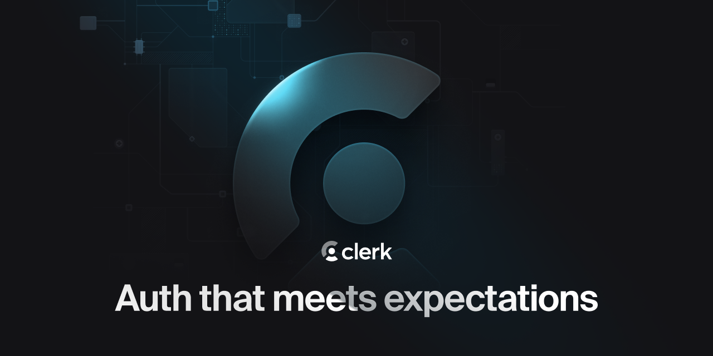

<p align="center">
  <a href="https://clerk.com?utm_source=github&utm_medium=clerk_docs" target="_blank" rel="noopener noreferrer">
    <picture>
      <source media="(prefers-color-scheme: dark)" srcset="./public/light-logo.png">
      
    </picture>
  </a>
  <br />
</p>
<div align="center">
  <h1>
    Clerk, Firebase, and Next.js App Router Demo
  </h1>  
  <a href="https://www.npmjs.com/package/@clerk/clerk-js">
    
  </a>
  <a href="https://discord.com/invite/b5rXHjAg7A">
    
  </a>
  <a href="https://twitter.com/clerkdev">
    
  </a> 
  <br />
  <br />
  
</div>


## Introduction

[Clerk](https://clerk.com/) is a developer-first authentication and user management solution. It provides pre-built React components and hooks for sign-in, sign-up, user profile, and organization management. Clerk is designed to be easy to use and customize, and can be dropped into any React or Next.js application.

[Firebase](https://firebase.google.com/) is Google’s all-in-one app development platform, providing developers with tools and infrastructure to build, scale, and improve apps quickly and efficiently.

Integrating Firebase with Clerk gives you the benefits of using Firebase's features while leveraging Clerk's authentication, prebuilt components, and webhooks.

After following [the Clerk + Firebase integration guide](https://clerk.com/docs/integrations/databases/firebase), you will have learned how to:
  - Configure Firebase to accept JWTs from Clerk
  - Create a JWT template in Clerk to generate Firebase JWTs
  - Use the Firebase JWTs to authenticate Firebase queries in your Next.js app

## Deploy

Easily deploy the template to Vercel with the button below. You will need to set the required environment variables in the Vercel dashboard.

[](https://vercel.com/new/clone?repository-url=https%3A%2F%2Fgithub.com%2Fclerkinc%2Fclerk-firebase-nextjs&env=NEXT_PUBLIC_CLERK_PUBLISHABLE_KEY,CLERK_SECRET_KEY&envDescription=Clerk%20API%20keys&envLink=https%3A%2F%2Fclerk.com%2Fdocs%2Fintegrations%2Fdatabases%2Ffirebase&redirect-url=https%3A%2F%2Fclerk.com%2Fdocs%2Fintegrations%2Fdatabases%2Ffirebase)

## Running the template

```bash
git clone https://github.com/clerkinc/clerk-firebase-nextjs
```

To run the example locally, you need to:

1. Sign up for a Clerk account at [https://clerk.com](https://dashboard.clerk.com/sign-up?utm_source=DevRel&utm_medium=docs&utm_campaign=templates&utm_content=10-24-2023&utm_term=clerk-firebase-nextjs).

2. Go to the [Clerk dashboard](https://dashboard.clerk.com?utm_source=DevRel&utm_medium=docs&utm_campaign=templates&utm_content=10-24-2023&utm_term=clerk-firebase-nextjs) and create an application.

3. Set the required Clerk environment variables as shown in [the example `env.local.example` file](./.env.local.example).

4. `npm install` the required dependencies.

5. Follow [the Clerk + Firebase integration guide](https://clerk.com/docs/integrations/databases/firebase) to set up your Firebase database.

6. `npm run dev` to launch the development server.

## Learn more

To learn more about Clerk and Next.js, check out the following resources:

- [Quickstart: Get started with Next.js and Clerk](https://clerk.com/docs/quickstarts/nextjs?utm_source=DevRel&utm_medium=docs&utm_campaign=templates&utm_content=10-24-2023&utm_term=clerk-firebase-nextjs)

- [Clerk Documentation](https://clerk.com/docs?utm_source=DevRel&utm_medium=docs&utm_campaign=templates&utm_content=10-24-2023&utm_term=clerk-firebase-nextjs)
- [Next.js Documentation](https://nextjs.org/docs)

## Found an issue or want to leave feedback

Feel free to create a support thread on our [Discord](https://clerk.com/discord). Our support team will be happy to assist you in the `#support` channel.

## Connect with us

You can discuss ideas, ask questions, and meet others from the community in our [Discord](https://discord.com/invite/b5rXHjAg7A).

If you prefer, you can also find support through our [Twitter](https://twitter.com/ClerkDev), or you can [email](mailto:support@clerk.dev) us!
# pwa-fb-clerck
